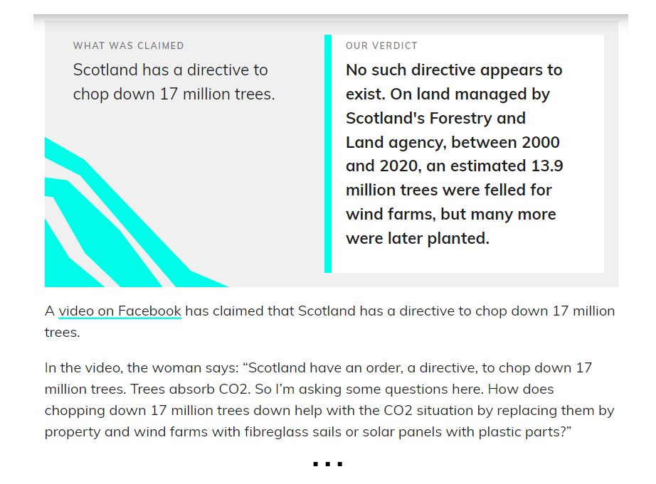

# Benchmarking the Generation of Fact Checking Explanations

This repository contains the code necessary to recreate the datasets employed in [**Benchmarking the Generation of Fact Checking Explanations**](https://direct.mit.edu/tacl/article/doi/10.1162/tacl_a_00601/117871/Benchmarking-the-Generation-of-Fact-Checking), namely **LIAR++** and **FullFact** datasets. If you use these datasets or any partial sections of them in your work, we kindly request to [cite](https://github.com/LanD-FBK/benchmark-gen-explanations/blob/main/README.md#bibtex-citation) our original paper.

- [LIAR++](#liar_plus_plus)
- [FullFact](#fullfact)

---

## LIAR++

We created LIAR++ starting from the LIAR-PLUS dataset [Alhindi et al., EMNLP 2018](https://aclanthology.org/W18-5513). LIAR-PLUS contains some entries in which the verdict was artificially created by extracting the last five sentences from the body of the article (silver data). In all the other cases, verdicts were extracted from a specific section of web pages, usually titled *Our ruling* or *Summing up* (gold data). LIAR-PLUS is publicly available and can be found [here](https://github.com/Tariq60/LIAR-PLUS). This dataset does not contain the articles' text, and POLITIFACT APIs are no longer available. To retrieve this information we leveraged the data IDs and scraped from scratch the articles. In the [liar_plus_plus folder](https://github.com/drusso98/fake_news/tree/main/liar_dataset/data) we provide a list of [all the LIAR-PLUS IDs](https://github.com/LanD-FBK/benchmark-gen-explanations/blob/main/liar_plus_plus/ids/ids.txt) as well as the list of the IDs of the gold data employed in our experiments (divided in [train](https://github.com/LanD-FBK/benchmark-gen-explanations/blob/main/liar_plus_plus/ids/train_ids.txt), [validation](https://github.com/LanD-FBK/benchmark-gen-explanations/blob/main/liar_plus_plus/ids/val_ids.txt), and [test](https://github.com/LanD-FBK/benchmark-gen-explanations/blob/main/liar_plus_plus/ids/test_ids.txt) sets). We also provide the [code]([https://github.com/drusso98/fake_news/blob/main/liar_dataset/scraper.py](https://github.com/LanD-FBK/benchmark-gen-explanations/blob/main/liar_plus_plus/src/scraper.py)) employed for scraping the articles from [PolitiFact website](https://www.politifact.com).


## FullFact
With a similar procedure to that used for LIAR++, we created a new dataset starting from the [FullFact website](https://fullfact.org). This dataset
contains data spanning from 2010 to 2021 and covers several different topics, such as health, economy, crime, law, and education. In FullFact the verdict is always present as a separate element in the web page so there was no need to filter the data. This dataset accounts for 1838 claim-article-verdict triples. Data were obtained by scraping from the website pages the necessary information. In [fullfact folder](https://github.com/LanD-FBK/benchmark-gen-explanations/tree/main/fullfact), we provide the list of the urls to the FullFact articles used for building our dataset (divided into [train](https://github.com/LanD-FBK/benchmark-gen-explanations/blob/main/fullfact/urls/ff_train_urls.txt), [validation](https://github.com/LanD-FBK/benchmark-gen-explanations/blob/main/fullfact/urls/ff_val_urls.txt), and [test](https://github.com/LanD-FBK/benchmark-gen-explanations/blob/main/fullfact/urls/ff_test_urls.txt) sets). 



---
## BibTex Citation

```
@article{10.1162/tacl_a_00601,
    author = {Russo, Daniel and Tekiroğlu, Serra Sinem and Guerini, Marco},
    title = "{Benchmarking the Generation of Fact Checking Explanations}",
    journal = {Transactions of the Association for Computational Linguistics},
    volume = {11},
    pages = {1250-1264},
    year = {2023},
    month = {10},
    issn = {2307-387X},
    doi = {10.1162/tacl_a_00601},
    url = {https://doi.org/10.1162/tacl\_a\_00601},
    eprint = {https://direct.mit.edu/tacl/article-pdf/doi/10.1162/tacl\_a\_00601/2163489/tacl\_a\_00601.pdf},
}
```
## Citation
```
Daniel Russo, Serra Sinem Tekiroğlu, Marco Guerini; Benchmarking the Generation of Fact Checking Explanations. Transactions of the Association for Computational Linguistics 2023; 11 1250–1264. doi: https://doi.org/10.1162/tacl_a_00601
```
---

**For any questions or inquiries, please contact drusso@fbk.eu**
